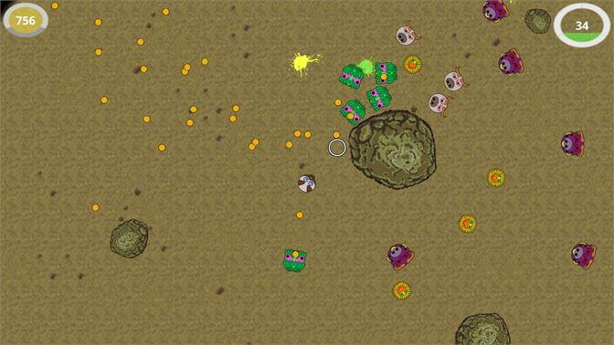
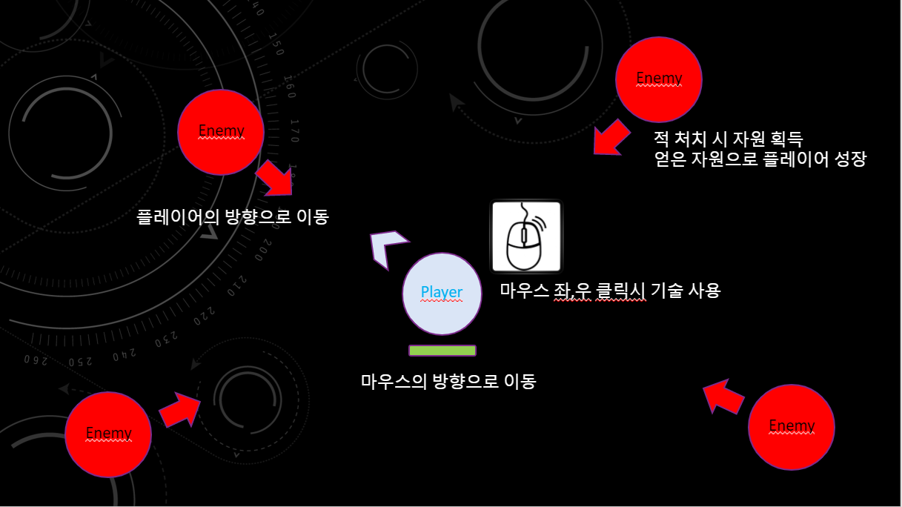
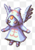
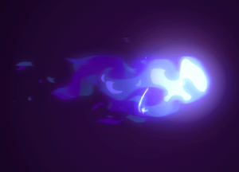

[[컨셉]](#1컨셉)  
[[관련 이미지 & 동영상]](#2관련-이미지--동영상)  
[5. 게임 오브젝트 분해](#5-게임-오브젝트-분해)  

# [컨셉]
## 메인컨셉 : 웨이브
- 웨이브란 게임에서 쉴새없이 몰려오는 적들을 뜻하며 플레이어에게 지속적인 긴장감을 제공

### 서브 컨셉 1 : 성장
- 핵 앤 슬래시의 매력은 시간을 들여 강해진 캐릭터가 적을 쉽게 처지할 때 오는 재미에 있음
- 플레이어 뿐만 아닌 적들도 시간에 따라 강해져 지루하지 않도록 균형을 맞추는것이 중요함

### 서브 컨셉 2 : 선택
- 플레이어의 선택에 따라 다르게 성장하는 게임은 매 시도마다 다른 재미를 줄 수 있음
- 플레이어는 나만의 방식으로 성장한 캐릭터에 애정을 가지게 됨 

### 서브 컨셉 3 : 스테이지
- 플레이어가 간편하게 즐길 수 있게 스테이지를 나누고 클리어한다는 목적을 부여
- 스테이지 바닥을 바꾸는 것만으로 다른 인상을 줄 수 있음 

### 서브 컨셉 4 : 간편한 조작
- 간편한 조작은 접근성을 높히고 플레이어가 게임을 부담없이 켤 수 있게함
- 마우스의 방향따라 이동하며 좌,우 클릭으로 공격하는 형태를 구상중

### 서브 컨셉 5 : 간단한 그래픽
- 많은 오브젝트가 생성되는 게임이므로 복잡하지 않게 간단한 그래픽을 사용

  
# [관련 이미지 & 동영상]

전체 컨셉 이미지

교단 컨셉 이미지

게임 플레이 이미지
  

# [대표 이미지]

  
# [컨셉 & 대표이미지 기반 작품묘사]
> ### 대표이미지 기반 : 마우스의 방향을 따라 플레이어가 이동하며 플레이어를 쫒는 적들을 마우스클릭으로 스킬을 사용하여 물리치는 게임

> ### 컨셉 기반: 많은 적들이 쉴새없이 몰려오기 때문에 빠른 템포로 플레이어가 성장하고 더 강한 기술을 사용하는 재미를 느낄 수 있음
  

## 1. 메커니즘

[도전 과제]
1) 몰려 오는 적들을 스킬을 사용해 처치
2) 설정해둔 적들을 모두 처치 할 때 까지 스테이지를 진행
3) 시간이 지날수록 강한 적이 생성
4) 강한 적을 처치하면 더 많은 자원을 얻음
5) 자원을 통해 플레이어가 성장

[재미 요소]
1) 빠른 템포로 쉽게 몰입해 플레이어를 성장시키는 재미 
2) 다양한 교단이 가진 특색과 그 특색을 살려 성장하는 재미

 

## 2. 이야기

악마가 세상을 침공하고 이를 막기위해 내려온 한 천사가 교단의 도움을 받아 침공을 막아내는 스토리
캐주얼 게임이므로 스토리보다는 게임 플레이에 중점

[카메라 관점]  
탑 뷰 형식

 

## 3. 미적요소

[디자인][컬러]
천사와 악마
흔한 소재이지만 표현할 수 있는 부분이 한계가 있는 탑 뷰 형식 게임에서 플레이어에게 확실한 이미지를 전달할 수 있음
또한 다양한 소재로 다양한 이미지를 제작할 수 있음

2D 형식의 게임은 리소스를 구하기 힘드므로 단순화한 그래픽으로 직접 제작할 예정

## 4. 기술 
많은 양의 객체가 생성/삭제 될것이 예상되므로 메모리풀을 구현해야함
특히 플레이어의 공격이나 스킬은 같은 프리팹 지속적으로 사용함으로 메모리풀의 중요성이 부각됨

이미 프리팹이 들어가 있는 리스트를 활성/비활성화 시키며 CPU의 부담을 줄이도록 구현할 예정

# [게임 시스템 디자인]
## 1. 게임 오브젝트 분해
|번호|이름|이미지|  
|---|---|---|  
|1|Playar||  
|2|Enemy||  
|3|Bullet||  
|4|Skill||  

 

## 2. 파라미터 분석
1) 오브젝트 이름 : Player  

|속성|속성값|설명|  
|:---|:---|:---|  
|이동 방향|Vector2|플레이어가 이동할 방향 마우스 벡터 – 플레어어 벡터|  
|이동 속도|10f|플레이어가 이동할 때 속도 적보다는 빨라야함|  
|정지 거리|2f|마우스가 플레이어와 가까워졌을 때 이동을 멈출 거리|
|공격 오브젝트|GameObject|자동으로 적을 공격할 때 생성될 오브젝트|  
|스킬 오브젝트|GameObject|마우스 클릭 시 생성될 오브젝트|  
|체력|100f|모두 소모될시 게임 오버가 되는 수치|  
|경험치|0f|일정 수치 이상이 되면 플레이어가 강해지는 수치|  

2) 오브젝트 이름 : Enemy 

|속성|속성값|설명|  
|:---|:---|:---|  
|이동 방향|Vector2|적군이 이동할 방향 플레이어 벡터 – 적군 벡터|  
|이동 속도|5~10f|적군이 이동할 때 속도. 적군마다 다른 수치를 가짐|  
|체력|10~100f|적군을 처치하기 위해 소모시켜야 하는 수치. 적군마다 다른 수치를 가짐|  
|공격력|5~20f|적군이 공격할떄의 수치. 적군마다 다른 수치를 가짐|  

3) 오브젝트 이름 : Enemy Manager

|속성|속성값|설명|  
|:---|:---|:---|  
|적군 오브젝트|GameObject|생성할 적군 오브젝트|  
|적군 리스트|GameObject List|생성한 적군을 저장할 리스트|  
|생성 간격|1~2f|적군을 생성할 간격|  
|카메라|Camera|카메라 바깥에서 적을 생성하기 위한 변수|  

4) 오브젝트 이름 :Bullet

|속성|속성값|설명|  
|:---|:---|:---|  
|공격력|10f|자동 공격 탄환이 입히는 피해량. 수치가 높아질 수 있음|  
|인식 거리|20f|자동 공격을 시작하는 거리|  
|이동 속도|50f|탄환이 이동할 때 속도|  
|지속 시간|1.5f|탄환이 지속되는 시간|  

5) 오브젝트 이름 : Skill

|속성|속성값|설명|  
|:---|:---|:---|  
|공격력|10f~100f|스킬이 입히는 피해량 수치가 높아질 수 있으며 스킬마다 다른 값을 가짐|  
|지속 시간|1f~10f|스킬이 지속되는 시간|  
|재장전 시간|2f~5f|스킬을 다시 사용하기까지 걸리는 시간. 스킬마다 다른 값을 가짐|  
|이동 속도|0~50f|스킬이 이동할 때 속도 스킬마다 다른 수치를 가짐|  

