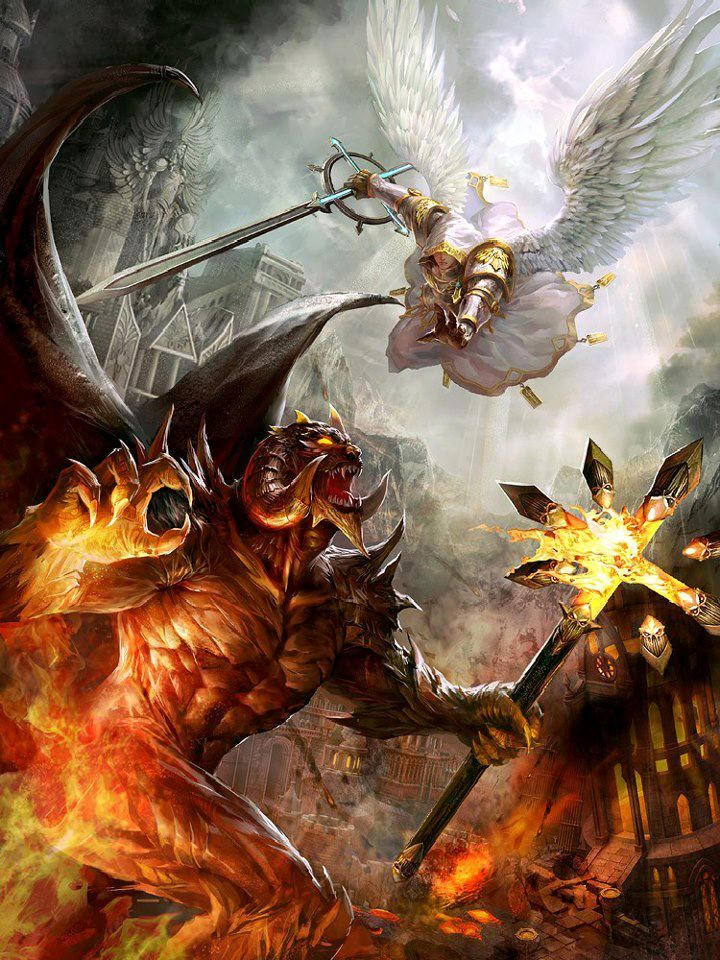

# [목차]
[1. 게임명 : Inferno](#게임명--Inferno)  
[2. 컨셉](#컨셉)  
[3. 관련 이미지 & 동영상](#관련-이미지--동영상)  
[4. 대표 이미지](#대표-이미지)  
[5. 컨셉 & 대표이미지 기반 작품묘사](#컨셉--대표이미지-기반-작품묘사)  
[6. 게임 구성요소](#게임-구성요소)  
[7. 게임 시스템 디자인](#게임-시스템-디자인)
- [a. 게임 오브젝트 분해](#게임-오브젝트-분해)
- [b. 파라미터 분석](#파라미터-분석)
- [c. 행동](#행동-뽑아-보기)
- [d. 상태](#상태-뽑아-보기)
- [e. 플레이어 파라미터](#플레이어-파라미터)
- [f. 게임의 규칙](#게임의-규칙)
- [g. 게임에서 사용될 공식](#게임에서-사용될-공식)

[8. 개발 요구사항 & 흐름도](#개발-요구사항--흐름도)
- [a. 요구사항(1년)](#요구사항1년)
- [b. 요구사항(6주)](#요구사항6주)

# [게임명 : Inferno]

인페르노는 이탈리아어로 지옥을 뜻하며 악마와 맞서 싸우는 컨셉을 표현한다.

# [컨셉]
## 메인컨셉 : 웨이브
- 웨이브란 게임에서 쉴새없이 몰려오는 적들을 뜻하며 플레이어에게 지속적인 긴장감을 제공

### 서브 컨셉 1 : 성장
- 핵 앤 슬래시의 매력은 시간을 들여 강해진 캐릭터가 적을 쉽게 처지할 때 오는 재미에 있음
- 플레이어 뿐만 아닌 적들도 시간에 따라 강해져 지루하지 않도록 균형을 맞추는것이 중요함

### 서브 컨셉 2 : 선택
- 플레이어의 선택에 따라 다르게 성장하는 게임은 매 시도마다 다른 재미를 줄 수 있음
- 플레이어는 나만의 방식으로 성장한 캐릭터에 애정을 가지게 됨 

### 서브 컨셉 3 : 스테이지
- 플레이어가 간편하게 즐길 수 있게 스테이지를 나누고 클리어한다는 목적을 부여
- 스테이지 바닥을 바꾸는 것만으로 다른 인상을 줄 수 있음 

### 서브 컨셉 4 : 간편한 조작
- 간편한 조작은 접근성을 높히고 플레이어가 게임을 부담없이 켤 수 있게함
- 마우스의 방향따라 이동하며 좌,휠 클릭으로 스킬을 사용하고 우클릭으로 대쉬를 사용하는 조작을 구상중

### 서브 컨셉 5 : 간단한 그래픽
- 많은 오브젝트가 생성되는 게임이므로 복잡하지 않게 간단한 그래픽을 사용

  
# [관련 이미지 & 동영상]

전체 컨셉 이미지

교단 컨셉 이미지

게임 플레이 이미지
  

# [대표 이미지]

  
# [컨셉 & 대표이미지 기반 작품묘사]
> ### 대표이미지 기반
마우스의 방향을 따라 플레이어가 이동하며 좌,휠클릭으로 스킬을 사용하고 우클릭으로 대쉬을 사용하여  
플레이어를 쫒는 적들을 피해 물리치는 게임

> ### 컨셉 기반
많은 적들이 쉴새없이 몰려오기 때문에 빠른 템포로 플레이어가 성장하고 더 강한 기술을 사용하는 재미를 느낄 수 있음
  

# [게임 구성요소]

## 1. 메커니즘

[도전 과제]
1) 몰려 오는 적들을 스킬을 사용해 처치
2) 설정해둔 적들을 모두 처치 할 때 까지 스테이지를 진행
3) 시간이 지날수록 강한 적이 생성
4) 강한 적을 처치하면 더 많은 자원을 얻음
5) 자원을 통해 플레이어가 성장

[재미 요소]
1) 빠른 템포로 쉽게 몰입해 플레이어를 성장시키는 재미 
2) 다양한 교단이 가진 특색을 살려 성장하는 재미
 

## 2. 이야기

악마가 세상을 침공하고 이를 막기위해 내려온 한 천사가 교단의 도움을 받아 침공을 막아내는 스토리
캐주얼 게임이므로 스토리보다는 게임 플레이에 중점

[카메라 관점]  
탑 뷰 형식

 

## 3. 미적요소

천사와 악마
흔한 소재이지만 표현할 수 있는 부분이 한계가 있는 탑 뷰 형식 게임에서 플레이어에게 확실한 이미지를 전달할 수 있음
또한 다양한 소재로 다양한 이미지를 제작할 수 있음

2D 형식의 게임은 리소스를 구하기 힘드므로 단순화한 그래픽으로 직접 제작할 예정

## 4. 기술 
많은 양의 객체가 생성/삭제 될것이 예상되므로 메모리풀을 구현해야함
특히 플레이어의 공격이나 스킬은 동일한 프리팹을 지속적으로 사용함으로 메모리풀의 중요성이 부각됨

이미 프리팹이 들어가 있는 리스트를 활성/비활성화 시키며 CPU의 부담을 줄이도록 구현할 예정

# [게임 시스템 디자인]
## 1. 게임 오브젝트 분해

|번호|이름|이미지|  
|---|---|---|  
|1|Playar||  
|2|Enemy||  
|3|Bullet||  
|4|Skill||  

 

## 2. 파라미터 분석
1) 오브젝트 이름 : 플레이어  

|속성|속성값|설명|비고|  
|:---|:---|:---|:---|  
|이동 방향|Vector2|플레이어가 이동할 방향|마우스 벡터 – 플레어어 벡터|  
|이동 속도|10f|플레이어가 이동할 때 속도 적보다는 빨라야함||  
|정지 거리|5f|마우스가 플레이어와 가까워졌을 때 이동을 멈출 거리||  
|공격 오브젝트|GameObject|자동으로 적을 공격할 때 생성될 오브젝트||  
|스킬 오브젝트|GameObject|마우스 클릭 시 생성될 오브젝트||  
|체력|100f|모두 소모될시 게임 오버가 되는 수치||  
|경험치|0f|일정 수치 이상이 되면 플레이어가 강해지는 수치||  

2) 오브젝트 이름 : 적군 

|속성|속성값|설명|비고|  
|:---|:---|:---|:---|  
|이동 방향|Vector2|적군이 이동할 방향|플레이어 벡터 – 적군 벡터|  
|이동 속도|5~10f|적군이 이동할 때 속도|적군마다 다른 수치를 가짐|  
|체력|10~100f|적군을 처치하기 위해 소모시켜야 하는 수치|적군마다 다른 수치를 가짐|  
|공격력|5~20f|적군이 공격할떄의 수치|적군마다 다른 수치를 가짐|  

3) 오브젝트 이름 : 적군 관리 오브젝트

|속성|속성값|설명|비고|  
|:---|:---|:---|:---|  
|적군 오브젝트|GameObject|생성할 적군 오브젝트||  
|적군 리스트|GameObject List|생성한 적군을 저장할 리스트||  
|생성 간격|1~2f|적군을 생성할 간격||  
|카메라|Camera|카메라 바깥에서 적을 생성하기 위한 변수||  

4) 오브젝트 이름 : 기본 탄환 오브젝트

|속성|속성값|설명|비고|  
|:---|:---|:---|:---|  
|공격력|10f|자동 공격 탄환이 입히는 피해량|수치가 높아질 수 있음|  
|인식 거리|20f|자동 공격을 시작하는 거리||  
|이동 속도|50f|탄환이 이동할 때 속도||  
|지속 시간|1.5f|탄환이 지속되는 시간||  

5) 오브젝트 이름 : 스킬 오브젝트

|속성|속성값|설명|비고|  
|:---|:---|:---|:---|    
|공격력|10f~100f|스킬이 입히는 피해량|수치가 높아질 수 있음, 스킬마다 다른 수치을 가짐|  
|지속 시간|1f~10f|스킬이 지속되는 시간||  
|재장전 시간|2f~5f|스킬을 다시 사용하기까지 걸리는 시간|스킬마다 다른 수치 가짐|  
|이동 속도|0~50f|스킬이 이동할 때 속도|스킬마다 다른 수치를 가짐|  

5) 오브젝트 이름 : 아이템

|속성|속성값|설명|비고|  
|:---|:---|:---|:---|  
|식별번호|01~30|아이템을 식별하는 번호||  
|지속 시간|10f|아이템이 지속되는 시간||  

## 3.행동 뽑아보기

1) 오브젝트 이름 : 플레이어

|행동|설명|  
|:---|:---|  
|이동|마우스의 방향을 따라 이동|  
|공격|적의 방향으로 자동으로 탄환을 발사|  
|스킬|마우스 좌,우 클릭 시 공격보다 강한 기술을 사용|  
|수집|땅에 떨어져 있는 아이템을 수집해 성장|  

2) 오브젝트 이름 : 적군

|행동|설명|  
|:---|:---|  
|이동|플레이어의 방향을 따라 이동|  
|공격|플레이어 방향으로 빠르게 돌진|  
|성장|시간에 따라 체력, 공격력 상승|  

## 4.상태 뽑아보기

1) 오브젝트 이름 : 플레이어

|현상태|전이상태|전이조건|  
|:---|:---|:---|  
|이동|정지|마우스가 플레이어와 5f만큼 가까이 있을떄 정지|  
|정지|이동|마우스가 플레이어와 5f만큼 멀어졌을때 이동|  
|공격 중지|공격|주변에 적군이 있을 경우 자동 공격 시작|  
|공격|공격 중지|주변에 적군이 없을 경우 자동 공격 중지|  
|생존|사망|체력 수치가 0이 되었을 때 사망|

2) 오브젝트 이름 : 적군  

|현상태|전이상태|전이조건|  
|:---|:---|:---|  
|생성|추적|오브젝트가 생성된후 플레이어가 생존해 있을 때|  
|추적|추적 중지|플레이어가 사망했을 때|  
|생존|사망|체력 수치가 0이 되었을 때 사망|  

## 5.플레이어 파라미터

|이름|영문명칭|설명|비고|  
|:---|:---|:---|:---|  
|체력|PlayerHealth|플레이어의 체력 수치|UI로 현상황 표시|  
|경험치|Exp|플레이어가 다음 단계로 성장하기까지 필요한 수치|UI로 현상황 표시|  
|스킬 쿨타임|SkillDelay|스킬을 연사할 수 없도록 비활성화 하는 시간|UI로 현상황 표시|  

## 6.게임의 규칙

1) 핵심 규칙  
1.게임 시작후 교단을 2개 선택한다. 선택한 교단에 따라 다른 스킬이 주어진다.  
2.게임 상단에 전투 시간이 표시되고 플레이어는 이 시간동안 몰려오는 적들을 스킬을 사용해 처치한다.   
3.주어진 웨이브를 모두 통과해 생존하면 승리  

1) 보조 규칙  
1.플레이어는 적을 처치할 때마다 경험치를 얻는다.  
2.경험치가 모두 차면 교단 2개중 하나가 선택되어 3개의 선택지가 제공된다.  
3.선택지를 통해 원하는 방향으로 플레이어를 강화할 수 있다.  

## 7.게임에서 사용될 공식

|이름|공식|  
|:---|:---|  
|웨이브당 적 체력 성장 수치|(현 웨이브 수/5) * (현재체력 * 0.2) + 현재 체력|  
|웨이브당 적 공격력 성장 수치|(현 웨이브 수/5) * (현재 공격력 * 0.1) + 현재 공격력|  

# [개발 요구사항 & 흐름도]

## 요구사항(1년)

- 시작화면, 게임화면, 교단 선택 화면, 도전 과제 화면 총 4개의 화면이 있다.  
- 시작화면에는 게임 시작, 도전 과제, 게임 종료라는 버튼 3개가 있다.  
- 게임 시작 클릭 시 게임화면으로 이동한다.  
- 게임 종료 클릭 시 게임을 종료한다.  
- 도전 과제 클릭 시 게임을 플레이하면서 해결해야하는 과제 목록을 보여준다.  
- 도전 과제는 게임 플레이 자체에는 영향을 주지않으며 도전 과제 해결 시 숨겨진 스토리를 보여준다.   
- 도전 과제 화면에는 돌아가기 버튼이 있고 클릭 시 시작화면으로 이동한다.  
- 시작화면에서 게임 시작을 누르면 교단 선택 화면으로 변경된다.  
- 교단 선택화면에서는 6개의 교단과 각 교단의 심볼이 표시된다.
- 심볼을 누르면 교단장의 그림과 함께 플레이어에게 주어지는 스킬과 설명, 교단의 특색이 표시된다.  
- 교단을 모두 선택하면 게임 화면으로 이동한다.  
- 게임 화면의 가운데 상단에는 웨이브 시간이 표시된다.  
- 게임 화면의 우측 상단에는 현재 웨이브 수가 표시된다.  
- 웨이브 수 밑에는 전투 중 획득한 아이템이 표시된다.  
- 게임 시작 시 화면 가운데에 Wave Start!라는 문구가 나오며 전투에 돌입한다.  
- 마우스의 방향에 따라 플레이어가 이동하며 카메라는 플레이어를 따라다닌다.  
- 카메라에서 화면의 폭, 높이를 구해 화면 바깥의 랜덤한 위치에서 적군이 생성되게 한다.  
- 적군은 플레이어를 자동으로 추적하며 플레이어와 부딪히면 가지고있는 공격력만큼 피해를 준다.  
- 플레이어는 일정주기마다 탄환을 발사해 주변에 있는 하나의 적군을 자동으로 공격한다.  
- 플레이어는 마우스 좌,우 클릭을 사용해 처음에 선택했던 교단의 스킬을 사용할 수 있다.  
- 스킬을 사용하면 재사용 대기시간이 스킬 아이콘과 함께 표시된다.  
- 스킬 아이콘은 교단의 심볼과 동일하다.  
- 적군을 처치하면 경험치가 오르며 경험치가 모두 차면 레벨 업이 된다.  
- 레벨 업 시 2개의 교단중 하나가 랜덤으로 선택되어 해당 교단의 3개의 선택지가 생성된다.  
- 선택지를 통해서 교단의 스킬이나 플레이어의 기본 능력치를 강화 시킬 수 있다.  
- 교단에 따라 강화 시킬 수 있는 플레이어의 기본 능력치가 각각 다르다.  
- 전투 중에는 화면 바깥의 랜덤한 위치에서 아이템 또한 생성되며 습득 즉시 효과가 발동한다.  
- 한 웨이브에 설정된 모든 적을 처치하면 다음 웨이브로 넘어간다.  
- 웨이브가 지날 수록 적군의 체력과 공격력이 강해지며 처음에는 나오지 않던 강한 종류의 적군이 등장한다.  
- 주어진 모든 웨이브를 버텨내면 승리하며 플레이어의 체력이 모두 소모되면 패배한다.  
- 승리 또는 패배 시 다시 시작화면으로 돌아간다.  

## 요구사항(6주)

- 시작화면, 게임화면, 교단 선택 화면 총 3개의 화면이 있다. 
- 시작화면에는 게임 시작, 게임 종료라는 버튼 2개가 있다.  
- 게임 시작 클릭 시 게임화면으로 이동한다.  
- 게임 종료 클릭 시 게임을 종료한다.  
- 시작화면에서 게임 시작을 누르면 교단 선택 화면으로 변경된다.  
- 교단 선택화면에서는 2개의 교단과 각 교단의 심볼이 표시된다.
- 심볼을 누르면 교단장의 그림과 함께 플레이어에게 주어지는 스킬과 설명, 교단의 특색이 표시된다.    
- 게임 화면의 우측 상단에는 현재 웨이브 수가 표시된다. 
- 게임 시작 시 화면 가운데에 Wave Start!라는 문구가 나오며 전투에 돌입한다.  
- 마우스의 방향에 따라 플레이어가 이동하며 카메라는 플레이어를 따라다닌다.  
- 카메라에서 화면의 폭, 높이를 구해 화면 바깥의 랜덤한 위치에서 적군이 생성되게 한다.  
- 적군은 플레이어를 자동으로 추적하며 플레이어와 부딪히면 가지고있는 공격력만큼 피해를 준다.  
- 플레이어는 일정주기마다 탄환을 발사해 주변에 있는 하나의 적군을 자동으로 공격한다.  
- 플레이어는 마우스 좌,우 클릭을 사용해 처음에 선택했던 교단의 스킬을 사용할 수 있다.  
- 주어진 모든 웨이브를 버텨내면 승리하며 플레이어의 체력이 모두 소모되면 패배한다.  
- 승리 또는 패배 시 다시 시작화면으로 돌아간다.  
